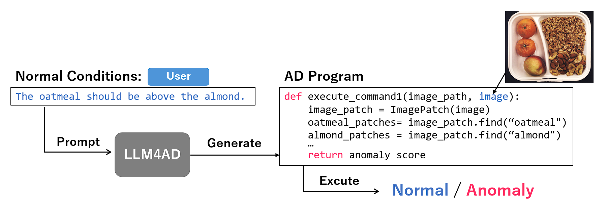

# LLM4AD(整理中。。)
LLM4AD is a system that automatically generates anomaly detection programs to identify logical anomalies in images of industrial products and other objects.

## Introduction
LLM4AD is a new approach for anomaly detection.
The user defines the normal conditions of the image (e.g., "2 oranges are present"), and the system automatically generates a computer vision program to determine whether the object in the image is normal or anomalous. The program is then executed to perform anomaly detection.

## Running the notebooks

## Requirement
PyTorchのインストール \
PyTorchの公式サイトで、自分の環境に合ったインストールコマンドを取得できます。
https://pytorch.org/get-started/locally/ \

一般的な環境では以下のコマンドでOK：

CPU環境
pip install torch torchvision torchaudio

GPU環境（CUDA対応）
pip install torch torchvision torchaudio --index-url https://download.pytorch.org/whl/cu121

※CUDAのバージョン（cu121など）は、nvcc --version で確認できます。
## Install
仮想環境を作成し，必要なパッケージをインストールした後，notebookを起動してください．カーネルには作成した仮想環境を選択しましょう．
## Usage

## Demo

## Licence                                                                                              

[MIT](https://github.com/tcnksm/tool/blob/master/LICENCE)

## Reference
[1]User Name, '大規模言語モデルを用いたプログラム自動生成による論理的異常の画像検知'

[takah1r0jp](https://github.com/takah1r0jp)
