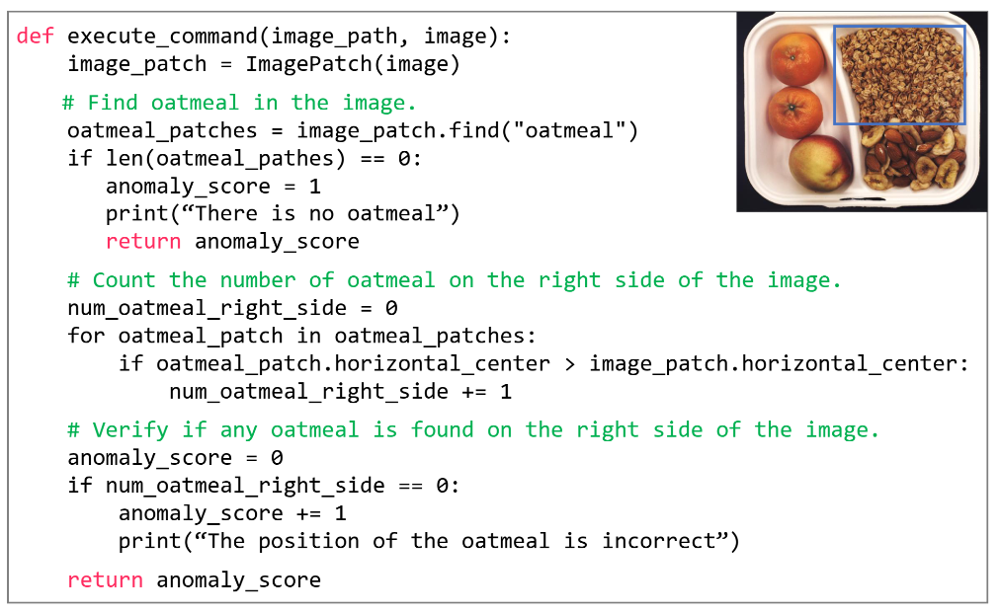

# LLM4AD: Logical Anomaly Detection using Large Language Models


This repository contains the implementation of a novel approach for logical anomaly detection in images using Large Language Models (LLMs).

## Overview

Logical anomaly detection is a challenging task in computer vision where the goal is to detect anomalies based on logical rules (e.g., correct number and placement of objects) rather than structural defects. Our approach leverages the powerful coding capabilities of LLMs to automatically generate computer vision programs that can detect logical anomalies from natural language descriptions of normal conditions.

### Key Features

- Natural language-based specification of normal conditions
- Automatic program generation using LLMs
- Integration with state-of-the-art computer vision components
- Evaluation on the MVTec LOCO AD dataset

## Background

Traditional anomaly detection approaches often rely on learning from a large number of normal samples. However, for logical anomalies, it is often more practical and intuitive to specify normal conditions in natural language rather than collecting numerous normal samples. Our approach bridges this gap by using LLMs to convert natural language descriptions into executable computer vision programs.

## System overview
- The user defines the "conditions of normality" for the target object from multiple perspectives (e.g., quantity and arrangement of image components).
- This text is inserted into a pre-defined prompt template.
- The prompt is sent to a large language model (LLM).
- The LLM generates a Python program to check whether each condition is met in a given input image.
- The program is executed on the actual image to detect any abnormalities.

<p align="center">
  
</p>

## LLM-generated code example
- The function was generated for the  image in the top right, given the normality condition: “The oatmeal should be above the almond.”
- The function first calls an object detection module using the find() method to detect oatmeal in the input image.
- It then calculates the center of the detected bounding box.
- By comparing it to the center of the image, the function determines whether the oatmeal is on the right side.
- If the condition is met, it returns an anomaly score of 0; otherwise, it returns 1.



## Results


## Installation

1. Create and activate a virtual environment:
```bash
python -m venv llm4ad_env
source llm4ad_env/bin/activate  # On Linux/Mac
# or
.\llm4ad_env\Scripts\activate  # On Windows
```

2. Install PyTorch:
```bash
# For CPU
pip install torch torchvision torchaudio

# For GPU (CUDA)
pip install torch torchvision torchaudio --index-url https://download.pytorch.org/whl/cu121
```

3. Install other dependencies:
```bash
pip install -r requirements.txt
```

## Usage

1. Launch Jupyter Notebook:
```bash
jupyter notebook
```

2. Select the created virtual environment as the kernel.

3. Open the demo notebooks in the `notebooks/` directory to run the examples.

## Demo

The demo notebooks demonstrate how to:
- Define normal conditions using natural language
- Generate and execute anomaly detection programs
- Evaluate results on sample images

## Requirements

- Python 3.8+
- PyTorch
- CUDA (optional, for GPU support)
- Other dependencies listed in `requirements.txt`

## License

This project is licensed under the MIT License.

## Reference

[1] User Name, '大規模言語モデルを用いたプログラム自動生成による論理的異常の画像検知'

## Author

[takah1r0jp](https://github.com/takah1r0jp)
